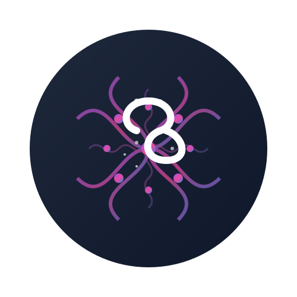
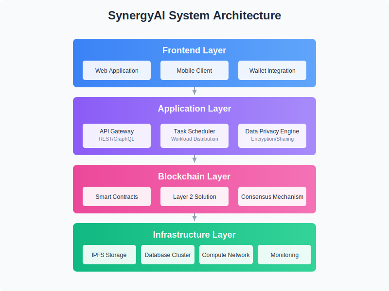

# SynergyAI

<div align="center">
  
  <br>
  <br>
  <a href="https://github.com/synergyaixyz/SynergyAI/releases">
    
  </a>
  <a href="https://github.com/synergyaixyz/SynergyAI/blob/main/LICENSE">
    
  </a>
  <a href="https://github.com/synergyaixyz/SynergyAI/stargazers">
    
  </a>
  <a href="https://github.com/synergyaixyz/SynergyAI/network/members">
    
  </a>
  <a href="https://github.com/synergyaixyz/SynergyAI/issues">
    
  </a>
</div>

<p align="center">Decentralized AI Compute Network powered by Blockchain</p>

---

## 📖 Project Overview

SynergyAI is a revolutionary ecosystem designed to democratize AI computing resources through decentralized collaboration, ensuring users maintain complete ownership of their data and models. The project integrates blockchain technology, distributed computing, and data sovereignty principles to create a fair, efficient, and secure platform for sharing AI resources.

### Core Pillars
1. **Collaborative Computing Network**: Global P2P computing resource network enabling shared computational power and optimized allocation
2. **Data Sovereignty System**: Users maintain complete control over personal data, with privacy guaranteed through encryption and permission management
3. **Triple Token Economy**: Sustainable value capture and incentive mechanisms through SYN, AIP, and DAT tokens

## ✨ Key Features

- Decentralized compute resource sharing and allocation
- End-to-end encrypted data storage and management
- Blockchain-based reward distribution system
- Task scheduling and result verification
- Governance proposal and voting mechanism
- Data marketplace for secure dataset exchange

## 🔌 Core APIs

- **Task Status API**: Monitor and update task execution status
- **Rewards Claim API**: Claim earned tokens for compute contributions
- **Results Verification API**: Validate computation results and resolve disputes
- **Governance API**: Create and vote on network improvement proposals
- **Data Marketplace API**: List, search, and purchase datasets

## 🏗️ Architecture

<div align="center">
  
</div>

The SynergyAI platform is built on a four-layer architecture:

1. **Blockchain Layer**: Solana smart contracts (programs) for token management, data access control, and compute resource management
2. **Compute Layer**: Node network for task execution and resource allocation
3. **Data Layer**: Encryption and storage systems for secure data management
4. **Application Layer**: Developer tools and user applications

## 💻 Technical Stack

- **Frontend**: React, Next.js
- **Blockchain**: Solana, Rust
- **Backend**: Node.js, Express
- **Storage**: IPFS, Encrypted distributed storage
- **Authentication**: Signature-based verification

## 📁 Project Structure

```
SynergyAI/
├── app/                    # Next.js application
│   ├── components/         # Reusable UI components
│   ├── contexts/           # React context providers
│   ├── hooks/              # Custom React hooks
│   ├── lib/                # Utility functions and libraries
│   ├── pages/              # Application pages
│   │   ├── api/            # API routes
│   │   │   ├── data/       # Data marketplace APIs
│   │   │   ├── governance/ # Governance APIs
│   │   │   ├── rewards/    # Rewards APIs
│   │   │   ├── task/       # Task management APIs
│   │   │   └── validation/ # Validation APIs
│   │   └── ...            # Frontend pages
│   └── styles/             # CSS and styling
├── programs/               # Solana programs (smart contracts)
├── docs/                   # Documentation
├── public/                 # Static assets
├── scripts/                # Utility scripts
└── tests/                  # Test files
```

## 🚀 Getting Started

```bash
# Clone the repository
git clone https://github.com/synergyaixyz/SynergyAI.git

# Install dependencies
npm install

# Run the development server
npm run dev
```

Visit [http://localhost:3000](http://localhost:3000) to see the application running.

## 📋 Prerequisites

- Node.js 16.x or higher
- npm 8.x or higher
- Phantom or another Solana-compatible wallet for blockchain interactions

## 🛠️ Development

```bash
# Run tests
npm test

# Build for production
npm run build

# Start production server
npm start
```

## 📜 License

This project is licensed under the MIT License - see the [LICENSE](LICENSE) file for details.

## 🤝 Contributing

Contributions are welcome! Please feel free to submit a Pull Request.

1. Fork the repository
2. Create your feature branch (`git checkout -b feature/amazing-feature`)
3. Commit your changes (`git commit -m 'Add some amazing feature'`)
4. Push to the branch (`git push origin feature/amazing-feature`)
5. Open a Pull Request

## 📞 Contact

- GitHub: [@synergyaixyz](https://github.com/synergyaixyz)
- Website: [synergyai.xyz](https://synergyai.xyz)
- Twitter: [SynergyAI_](https://x.com/SynergyAI_)
